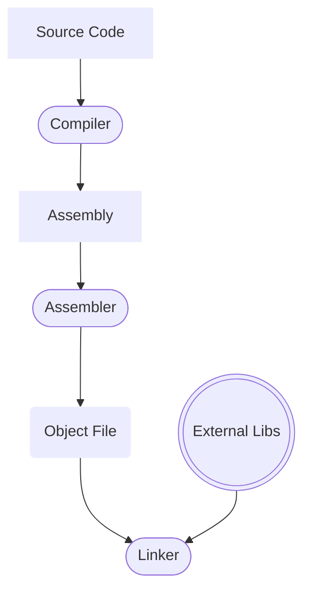

# Compilation Overview

## Assemblers

For the x86 architecture 2 examples of Assemblers are `NASM` (mostly for Linux) and `MASM` (Ms Macro Assembler for Windows). For windows you can see more details [here](https://learn.microsoft.com/en-us/cpp/assembler/masm/masm-for-x64-ml64-exe?view=msvc-170).
